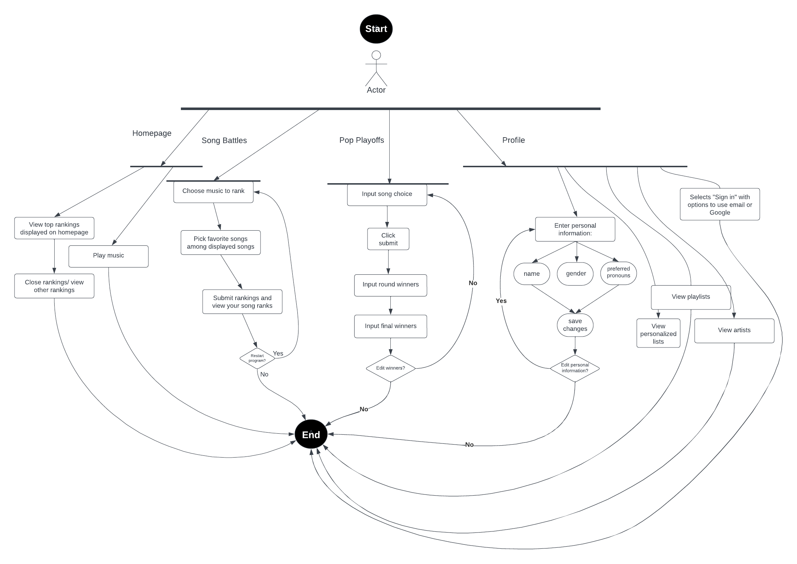
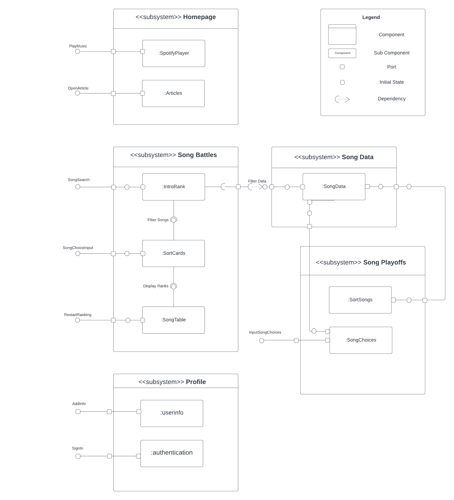
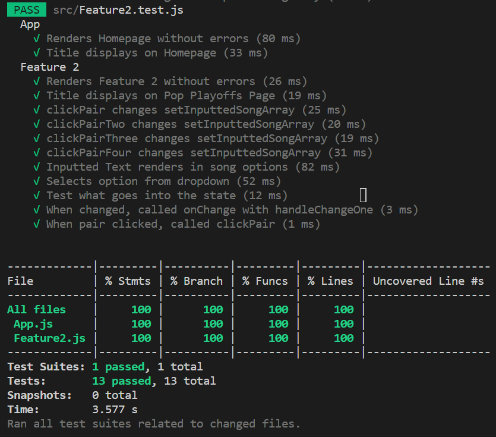

# Assignment 1 INFO 443
By Elizabeth Gronski and Tiffany Chung

## Introduction
This codebase is from our INFO340 class. We will be looking at the react-app which builds an interactive web application about ranking music. The code project is called Melody Madness. It was created by Elizabeth and Tiffany, along with our previous group members Kassy Chaput and Juliette Jones.

## Code Structure Analysis

### Architectural Elements
The architectural elements of the React-based application include App.js, Feature1.js, Feature2.js, Homepage.js, index.js, Navigation.js, Profile.js, and index.css. 

1. Import Statements
    - ‘import ‘,/index.css’; imports styles to control the visual appearance
    -  Import statement for components like ‘HomePage’, ‘Feature1’, ‘Feature2’, and ‘Profile’ bring in various parts of the Melody Madness website
    - Libraries and components imported include React, useState, useEffect, Link, Navigation, Footer, and firebase for handling user authentication and Firestore database

2. Navigation Element is the bar that helps users navigate to a different section of the website.
    - This navigation element provides navigation links to different places within the app, such as the homepage, different features, or the user’s profile

3. Footer Element contains information such as copyright notices and links to important pages.
    - This footer includes the Melody Madness website, as well as the authors Kassy Chaput, Juliette Jones, Beth Gronski, Tiffany Chung, and a link to the email: info@melodymadness.com

4. App.js Component is the main control center of the application. It decides what to show on the webpage based on the web address (URL).
    - Routing Configuration: This is like a map for the website. It says which page to show when the user navigates to a different web address. For instance, when they go to “/home,” it shows on their homepage. It uses the ‘Routes’, ‘Route’, and “Navigate’ components from ‘react-router-dom.’

5. Homepage.js Component displays the most recent ranking of songs as well as navigation links when the users first visit the website.
    - SpotifyPlayer: this component from `react-spotify-player` embeds a Spotify player into the page, and allows users to play music.
    - Click Handling Function: the ‘handle Click’ function determines which article should be displayed on what the user interacts with the “show me!” buttons.
    - Child Components: there are three child components, ‘BrunoSongList’, ‘SongList2013’, and ‘HipHopSongList’ that are displayed when the user clicks on the “show me!” buttons.

6. Feature1.js Component is the Song Battles page where users can customize their song lists. They can rank songs by genre, artist, or year and search for an artist to add to a playlist with a name of their choice.
    - IntroRank: this component handles the filtering and setup so that users can filter, enter search words, and set a playlist name before starting the ranking process. This filtered data is then sent to the SortCards component.
    - SortCards: this component manages the song ranking process, and presents users with pairs of songs to choose from. After the user ranks the songs, they can submit their rankings. The number of times each song is chosen is sent to the SongTable component.
    - SongTable: this component displays the final table of ranked songs. It sorts the songs by the number of times they were chosen, and the song chosen the most is the highest ranking song. 
    - SongRow: this is a sub-component within the ‘SongTable’ component. It takes in song data, such as the artist, title, year, and rank, and then displays this data within a table row.

7. Feature2.js Component  is Pop Playoffs, where users can enter the pair of songs they prefer and then click 'Submit.' Afterward, they will choose a winner from each pair using the drop-down menus.
    - RoundOne: this component represents the first round of “Pop Playoffs” It renders the user interface elements that are related to this round. It also has dropdowns for song selections and updates the state based on user choices. Those choices are then sent to RoundTwo, mimicking a bracket where the winner continues on.
    - RoundTwo: similar to RoundOne, this component represents the second round of the competition. It handles the rendering of dropdowns for user choices and updates the state based on user choices. Those choices then move onto the final round, within the Winner component.
    - Winner: this component handles the final winner of the competition. It displays a dropdown for the user to select the final winner.

8. Profile2.js Component will allow users to view and customize their profiles based on their song preferences.
    - useEffect: This hook runs once when the component mounts, calling `initFirebaseUI`. It initializes Firebase Authentication UI.
    - JSX Elements: these elements are used to create what the user sees, like text, buttons, and input fields.
    -  Event Handling Functions: handleGenderChange, handlePronounChange, handleSubmitChange are like instructions for the web page on what to do when the user clicks on a button or changes something. For instance, when the user picks a gender or submits their profile.

9. Index.css defines the styles (layout, colors, fonts, etc) for the web page. It includes various styling rules for different elements on the website, such as fonts, colors, layout, margins, etc.
    - @font-face: This is a CSS rule that defines a custom front called “Graffiti” and specifies the source URL for the font file.
    - Universal Selector (*): This selector targets all HTML elements and sets some common styles. It includes making sure spacing and fonts are consistent.
    - Element Selectors: The selectors, html, body, h2, div, .container-fluid, .card, .row, .row, .column, header, h1, img, footer, .card-body, .playlist-info, .playlist-info table, .playlist-info h2, all target specific HTML elements or classes and define their styles. For instance, the ‘header selector specifies the background image and text styling for the page header.
    - Media Queries: These include @media(min-width:528px), #media(min-width: 768px), @media(min-width: 992px), and @media(min-width:1200px). The media queries define different styles for various screen sizes and each query applies the viewpoint width that matches the specified minimum width.
    - CSS Classes: These classes include .button-1, search-bar, .alert, .song, .round, .matchup, and .bracket. These classes can be used to style specific elements such as  a button differently from other elements.
    - Pseudo-classes: Pseudo classes such as :hover, can be used to define styles for elements when a user hovers over them.
    - Descendant Selectors: Selectors such as div header and div.spotify-player are used to target elements that are descendants of other elements. For instance, `div header` selects `header` elements that are descendants of `div` elements.
    - ID Selectors:  target elements such as `#firebaseui-auth-container` with a unique ID attribute and apply styles to them.

### Diagrams
Here are the diagrams for the current checkpoint:

**UML Activity Diagram UML Activity Diagram:**
- Our activity diagram displays how users will use our application. The web application will start on the homepage, but there is no set flow from one page to another so users can travel to any page and work through that flow. 
On the Homepage users can view the displayed rankings or play music on the spotify player. 
On the Song Battles page, users are able to create their own unique playlist by ranking songs by genre, artist, or year. After they filter their songs for their playlist, they are given two songs at a time and asked to choose their favorite song of the two. Then they can access a list of their rankings. 
On the Pop Playoffs page, users can create their own bracket of songs to display. They can add in the songs they want to display and then choose the winners of each round, first, second and then the winners. 
Lastly, on the Profile page there are many places to start from: You can add your personal information to your profile and save those changes. You can also view playlists, artists, and your personalized lists. Finally you can connect your Google/email account to the application to save your rankings (this is a theorized activity and doesn’t actually work as it is supposed to).

**UML Component Diagram UML Component Diagram**
- The component diagram represents our application by displaying our 4 main pages and their main components, and how our features connect to our song data. Each of our pages are very independent, and do not really interact with each other, which is why this component diagram is very separated. 

Process Flow
- The main connections within the diagram are the connections to the data in the features. Feature 1 connects to SongData to filter the songs that will ultimately be ranked. The same concept would work for Feature 2 (another theoretical function that is coded in but does not work). The main process flows are within the features, where the data is brought in and transformed so the user can engage with it. 

### Architectural Elements

#### Feature 2

1. Repetitive Event Handlers
    - Problem: There is repetitive code for handling input fields for song names and dropdowns for selecting winners. In feature 2, there are multiple similar functions of `handleChangeOne` and `handleChangeTwo` that are similarly structured JSX blocks.
    - Solution: Create a reusable function that contains the code we are using in multiple places. Then, wherever we need that functionality, we can call or include this function.
2. Repetitive State Initialization
    - Problem: In Feature 2, we used ‘useState’ for eight different input fields, which is a lot of repetitive code
    - Solution: Instead of creating separate variables for each input, we can use an array to store all the song choices
3. Hard Coded Texts
    - Problem: Texts such as “Select!” and “Type in your song choice first!” are hardcoded throughout the code in feature 1. It would be a better practice to extract the strings into variables for better code maintainability.
    - Solution: Store such text in variables to make it easier to change
4. Lack of Comments
    - Problem: the code lacks comments or documentation, which makes it less clear for someone new reading the code
    - Solution: to address the lack of comments, we can add them at various parts of the code to explain the code’s functionality. For example, having a comment as “Event handler for submitting song pairs” helps describe the purpose of the “handlePairSubmit” function
5. No Component Separation
    - Problem: in the Feature 2 code, everything is packed into one big section of code, which can make it difficult to manage. The inner functions of Round One, Round Two, and Winner components are defined within the main component rather than being separate, reusable react components makes the code harder to understand
    - Solution: refactor the code into separate functional components where each component focuses on a specific task

### Unit Testing

#### Automated Tests 
Our automated tests focused on Feature 2, specifically on the "Pop Playoffs" page of our website. We completed 13 tests, all of which passed. 

We conducted two tests on the App.js file. The tests are as follows:

We chose these tests to make sure our website functions correctly. Tests 1-3 focuses on rendering components without errors. Our goal is to make sure that when the user opens the webpage, everything appears as expected without any problems.

**Test 1: "Renders Homepage without errors"**
- This test ensures that the test component can be rendered without any errors and can load successfully without any errors

**Test 2: "Title displays on Homepage"**
- This test validates that the title “Melody Madness” is correctly displayed on the homepage.

Our architectural element tests for the test suite of Feature 2:

 **Test 3: "Renders Feature 2 without errors"**
 - Verifies that the component can be rendered without errors. It also confirms that the title "Pop Playoffs" appears as expected on the page

**Test 4: “Title displays on Pop Playoffs Page"**
- This test checks to see if the title “Pop Playoffs” is displayed in the Feature 2 component

Test 5-9 are centered around user interactions with the buttons for selecting the song pairs. We want to verify that these buttons perform their intended actions. For example, when a user picks a song, we check if the website responds appropriately.

**Test 5-9: "clickPairOne changes setInputtedSongArray", "clickPairTwo changes setInputtedSongArray", "clickPairThree changes setInputtedSongArray", "clickPairFourchanges setInputtedSongArray":**
- These tests look into a button function and ensure that when a button for selecting a song pair is clicked, the "setInputtedSongArray" function is called. It ensures that the user interactions trigger the intended state changes

Test 10 examines input fields and ensures that the users can input text, and the displayed text updated correctly. 

**Test 10: "Inputted Text renders in song options"**
- This test looks into the input fields and checks if users can input text into these fields and if the displayed text updates accurately

Test 11 checks if users can pick options from dropdown menus and if the chosen option is highlighted properly. This is important for having a good user experience.

**Test 11: "Selects option from dropdown"**
- This test focuses on dropdown menus and the selection of options. It verifies if users can select an option from a dropdown menu and if the selected option is correctly highlighted.

Test 12 checks to see how the ‘userState’ function is being used to manage the component’s state.

**Test 12: "Test what goes into the state"**
- This test looks into how the "useState" function is utilized. It checks if the component correctly uses "useState" to manage its state

Finally, test 13 checks the behavior of “onChange” event, specifically related to the ‘handleChangeOne” function. This is important for validation event handling and helps ensure that when the user types something into a box, it causes the website to react the right way.

**Test 13: "When changed, called onChange with handleChangeOne"**
- This test checks the behavior of an "onChange" event related to a specific input field.
It makes sure that when text input changes in a particular field, the"handleChangeOne" function is called

Test Coverage
This is a screenshot of our test coverage, demonstrating that all 13 tests in the App and Feature 2 component have passed successfully, achieving 100% coverage.

**To run tests**: On the terminal please run `npm test` within our project folder. You can also run `npm test -- --coverage` to see the above results which display that we have tested 100% of our code. 

### Code Refactoring
Firstly, and our most significant problem was the repetitive event handlers that performed the same function throughout the component. To fix this issue, we consolidated these handlers into the four different functions they served: handling changing input, submitting a pair of songs, choosing songs that win round 1 and round 2. This eliminated the multiple event handlers for each action the user performed. The refactoring technique we utilized was Mapping the Elements and Reusable functions. We created a single event handler function for each type of action and passed an ‘index’ as an argument to the specific item in the arrays to update. We also used dynamic event binding by passing a unique ‘index’ to each event handler. This eliminates the need to go throughout the feature and change several lines of code to implement one modification. 

Secondly, we had a very similar problem with the multiple uses of state throughout the component. Like the event handlers, we had separate state variables for each input field, dropdown, and winner. We consolidated these state variables into arrays: ‘inputtedSongs’ (stores the values of all input fields for song names), ‘choices’ (array to store the dropdown choices for Round 1), and ‘winners’ (array to store the dropdown choices for Round 2). To eliminate this State Consolidation was used to combine similar state variables into arrays. We also used Array Initialization to initialize the arrays with default values like empty string and “Select”.

Thirdly, we had many instances of hard-coded values, such as our text for our placeholders. We originally wanted to change these values to variables, but instead limited their use by scaling down our event handlers and states throughout the document. Now we have only one instance of each so there is no need to go throughout the document to change each one. However we still had multiple instances of “Select!” so we did create a variable for this text. We used String Constants to  define string constant and avoid hardcoding so it can improve code maintainability 

Fourthly, we had no comments within our code and additionally our functions did not explain themselves very well. So we adjusted our function names to be more comprehensive and added necessary comments where necessary. Anyone reading our code should be able to understand the functionality. The refactoring technique we utilized was making our code easier to understand without overwhelming it with unnecessary information. We limited our comments and kept as much information within function names as possible. 

Finally, we had all of our functionality and variables in one large component with no separation. To solve this we created individual functions that handle each round of our bracket. Firstly, you see the section handling states and eventHandlers, then us setting up our inputted songs section. Lastly, in our return section you can see separate functions for each round: `RoundOne()`, `RoundTwo()`, and `Winner()`. The refactoring techniques we utilized were Component Separation and Cleaner Code Structure. We created more organization within our code to not overwhelm others reading it with disorganization.

## Conclusion
Within our investigation and analysis of our Melody Madness web application, we discovered that our code was inefficient and really stinked from some very common code smells. Through test writing we found lots of repetitive functions and code that didn’t do anything. Not only were we able to accomplish test writing, but we also were able to clean up our code in the process. This also helped us to identify ways to improve our code that wasn’t as easily fixable while test writing. Overall, this process helped us improve our web application (or parts of it) and reflect on our code writing practices in the future. 
